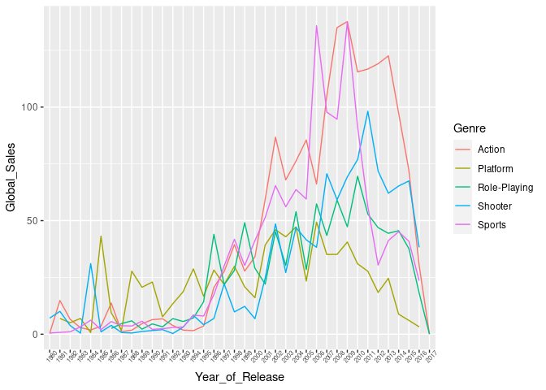
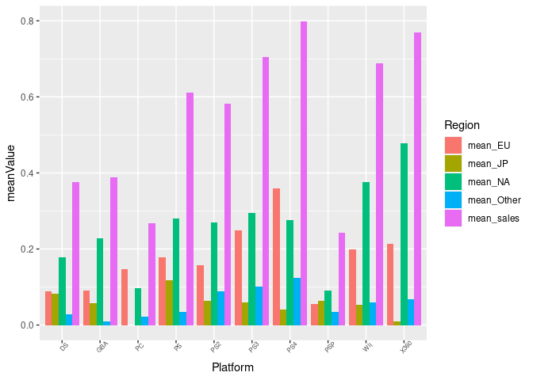
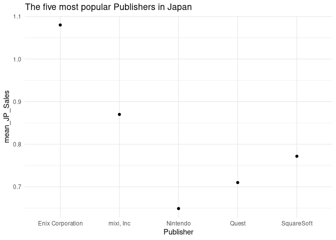
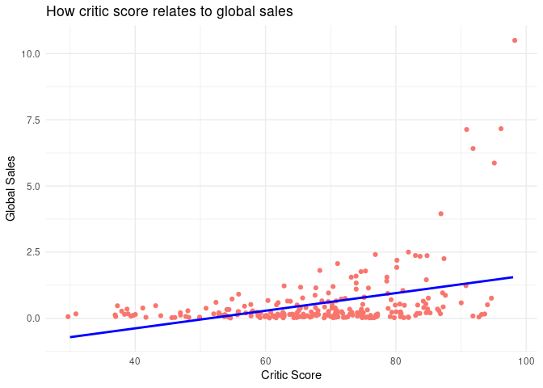
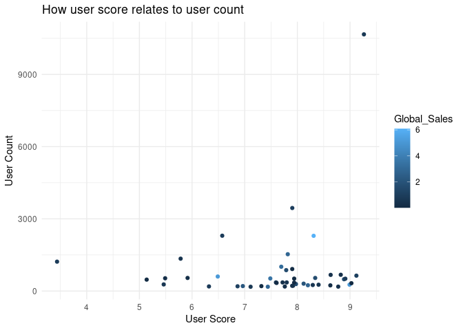
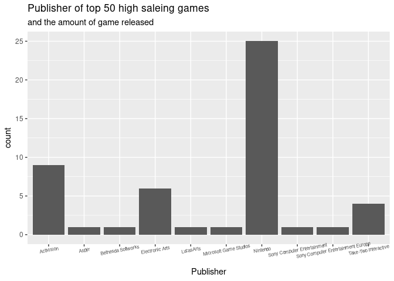
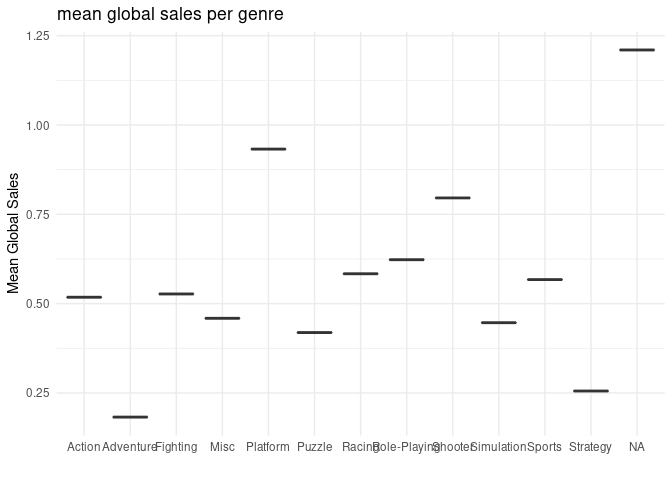

Project proposal
================
Disco

``` r
library(tidyverse)
library(broom)
library(dsbox)
library(ggridges)
library(ggplot2)
library(readr)
library(here)
library(scales)
library(dplyr)
```

``` r
video_game_sales <- read_csv(here::here("data/Video_Games_Sales_as_at_22_Dec_2016.csv"))
```

    ## Rows: 16719 Columns: 16

    ## ── Column specification ────────────────────────────────────────────────────────
    ## Delimiter: ","
    ## chr (8): Name, Platform, Year_of_Release, Genre, Publisher, User_Score, Deve...
    ## dbl (8): NA_Sales, EU_Sales, JP_Sales, Other_Sales, Global_Sales, Critic_Sco...

    ## 
    ## ℹ Use `spec()` to retrieve the full column specification for this data.
    ## ℹ Specify the column types or set `show_col_types = FALSE` to quiet this message.

## 1. Introduction

Our question is: what factor influences the sales of a video game the
most.

Data is collected from
<https://www.kaggle.com/rush4ratio/video-game-sales-with-ratings>

(This dataset contains a list of video games with sales greater than
100,000 copies.)

## 2. Data

``` r
video_game_sales <- read_csv(here::here("data/Video_Games_Sales_as_at_22_Dec_2016.csv"))
```

    ## Rows: 16719 Columns: 16

    ## ── Column specification ────────────────────────────────────────────────────────
    ## Delimiter: ","
    ## chr (8): Name, Platform, Year_of_Release, Genre, Publisher, User_Score, Deve...
    ## dbl (8): NA_Sales, EU_Sales, JP_Sales, Other_Sales, Global_Sales, Critic_Sco...

    ## 
    ## ℹ Use `spec()` to retrieve the full column specification for this data.
    ## ℹ Specify the column types or set `show_col_types = FALSE` to quiet this message.

``` r
glimpse(video_game_sales)
```

    ## Rows: 16,719
    ## Columns: 16
    ## $ Name            <chr> "Wii Sports", "Super Mario Bros.", "Mario Kart Wii", "…
    ## $ Platform        <chr> "Wii", "NES", "Wii", "Wii", "GB", "GB", "DS", "Wii", "…
    ## $ Year_of_Release <chr> "2006", "1985", "2008", "2009", "1996", "1989", "2006"…
    ## $ Genre           <chr> "Sports", "Platform", "Racing", "Sports", "Role-Playin…
    ## $ Publisher       <chr> "Nintendo", "Nintendo", "Nintendo", "Nintendo", "Ninte…
    ## $ NA_Sales        <dbl> 41.36, 29.08, 15.68, 15.61, 11.27, 23.20, 11.28, 13.96…
    ## $ EU_Sales        <dbl> 28.96, 3.58, 12.76, 10.93, 8.89, 2.26, 9.14, 9.18, 6.9…
    ## $ JP_Sales        <dbl> 3.77, 6.81, 3.79, 3.28, 10.22, 4.22, 6.50, 2.93, 4.70,…
    ## $ Other_Sales     <dbl> 8.45, 0.77, 3.29, 2.95, 1.00, 0.58, 2.88, 2.84, 2.24, …
    ## $ Global_Sales    <dbl> 82.53, 40.24, 35.52, 32.77, 31.37, 30.26, 29.80, 28.92…
    ## $ Critic_Score    <dbl> 76, NA, 82, 80, NA, NA, 89, 58, 87, NA, NA, 91, NA, 80…
    ## $ Critic_Count    <dbl> 51, NA, 73, 73, NA, NA, 65, 41, 80, NA, NA, 64, NA, 63…
    ## $ User_Score      <chr> "8", NA, "8.3", "8", NA, NA, "8.5", "6.6", "8.4", NA, …
    ## $ User_Count      <dbl> 322, NA, 709, 192, NA, NA, 431, 129, 594, NA, NA, 464,…
    ## $ Developer       <chr> "Nintendo", NA, "Nintendo", "Nintendo", NA, NA, "Ninte…
    ## $ Rating          <chr> "E", NA, "E", "E", NA, NA, "E", "E", "E", NA, NA, "E",…

## 3. Data analysis plan

We will look at the different relationships between the sales (global
and specific) of a game and different factors in its release and
success. All sorts of different plots (e.g. line plot, density plot, bar
plot etc.) and data analysis methods (mean, median and mode) will be
used to discuss this and visualize this in our different individual
ways.

IN GENERAL, WE ARE ANSWERING THE QUESTION:

“WHAT FACTOR HAS THE BIGGEST INFLUENCE OF SALES ON VIDEO GAMES?”

It will follow the ensuing format:

``` r
top_genre <- video_game_sales%>%
  group_by(Genre)%>%
  summarise(global = sum(Global_Sales))%>%
  slice_max(global, n = 5)
  
top_genre_list <<- top_genre$Genre

top_platform <- video_game_sales%>%
  group_by(Platform)%>%
  summarise(global = sum(Global_Sales))%>%
  slice_max(global, n = 10)
  
top_platform_list <<- top_platform$Platform

top_games <- video_game_sales%>%
  group_by(Name)%>%
  summarise(sales = sum(Global_Sales))%>%
  slice_max(sales, n = 50)

top_games_list <<- top_games$Name
```

### First Data

#### A line graph showing the relationship between genre of game and TOTAL global sales over the years

This plot will clearly show the best genre (in terms of global sales)
over the years. From this we can determine how much genre influences the
sales over time and classify any trends for particular time periods.

#### code and plotting: a single line graph with top 5 genres and faceted graphs

``` r
genre_sales_yrs <- video_game_sales%>%
  group_by(Year_of_Release, Genre)%>%
  filter(!Year_of_Release == "N/A") %>%
  filter(!is.na(Genre)) %>%
  summarise(Year_of_Release, Genre, Global_Sales = sum(Global_Sales))%>%
  group_by(Genre)%>%
  filter(Genre %in% top_genre_list) %>%
  distinct()
```

    ## `summarise()` has grouped output by 'Year_of_Release', 'Genre'. You can override using the `.groups` argument.

``` r
genre_sales_yrs$Year_of_Release <- as.numeric(as.character(genre_sales_yrs$Year_of_Release))

genre_sales_yrs%>%
  ggplot(aes(x = Year_of_Release, y = Global_Sales, color = Genre, group = Genre)) +
  theme(axis.text.x = element_text(angle = 45, size = 6)) +
  geom_line()+
  scale_x_continuous(name ="Year of release", breaks=seq(1980, 2020, 5))+
  scale_y_continuous(name ="Total global sales", breaks=seq(0, 150, 50))
```

<!-- --> This plot
clearly shows that, from the top 5 best selling genres of the data,
sports and action games have the biggest peaks (approximately 135
million global sales). But we can also see that these genres have not
always been the best selling: while they have not had the best selling
in the past 15 years, platform games have consistently achieved a large
amount of global sales (for the entirety of the period between 1984 and
1995, it was by far the best selling genre). Yet in the most recent
years, games of the platforming genre have certainly been dropping off
in sales.

### Second Data

#### A facet graph of mean sale for different area against (top 10) platform(x = platform, y = mean sale) by bar plot or histogram plot

This plot will show us, not only the most successful platform (the
platform with the highest mean global sales) but also where these sales
come from: the splitting of the mean sales to region will show where
particular platforms perform especially well and where they do not. This
will allow us to determine how much platforms in certain regions will
influence the global sales of a game.

#### code and plotting.

``` r
mean_df_long %>%
  #ggplot(aes(x=Platform))+
  # geom_point(aes(y=mean_sales, colour = "Global"))+
  # geom_point(aes(y=mean_NA, colour = "North America"))+
  # geom_point(aes(y=mean_JP, colour = "Japan"))+
  # geom_point(aes(y=mean_EU, colour = "Europe"))+
  # geom_point(aes(y=mean_Other, colour = "Other"))
  ggplot(aes(x = Platform, y = meanValue, fill = Region, group = Region)) +
  geom_bar(stat="identity", position='dodge')+
  theme(axis.text.x = element_text(angle = 45, size = 6))
```

<!-- --> ### Analysis

From the plot, we can see that, overall, north america contributes the
most to the global sales of video games across most platforms; excluding
the PS4 and PC (for which the highest mean sales is Europe), North
America is the biggest seller of video games across platforms. This will
be due to a mix of large population and a high percentage of said
population with access to these consoles. The opposite can be said about
the lower end: Japan and ‘Other’ regions are on the lower end of mean
sales for all platforms: they, in this context, have lower populations
and lower percentage of said populations with access to these consoles
and therefore it makes sense that they do not contribute as highly to
the total global sales of video games across all platforms.

### Third Data

#### A point gragh presenting the relationship between the pubisher and the mean japan’s sales, which are the top five ones. (x = Publisher, y = mean_JP_Sales).

#### code and plotting

``` r
video_game_sales %>%
  group_by(Publisher) %>%
  summarise(mean_JP_Sales = mean(JP_Sales)) %>%
  arrange(desc(mean_JP_Sales)) %>%
  slice(1:5) %>%
  ggplot(aes(x = Publisher, y = mean_JP_Sales)) +
  geom_point() +
  labs(title = "The five most popular Publishers in Japan",
       x = "Publisher", y = "mean_JP_Sales"
       ) +
  theme_minimal() 
```

<!-- -->

### Fourth Data

#### A comparison graph of critic score and global sales (x variable = critic score, y variable = global sales) and how they relate to each other using a line graph.

This plot will show the relationship between critic score and global
sales. It will help visualize how critic score affects global sales - if
critic score has an effect on global sales either negatively or
positively.

#### code and plotting

``` r
sample_data <- video_game_sales %>%
 sample_n(500)

sample_data %>%
  ggplot(aes(x = Critic_Score, y = Global_Sales, col = "red")) +
  geom_jitter()+
  geom_smooth(method = "lm", se = FALSE, col = "blue") +
  labs(title = "How critic score relates to global sales",
       x = "Critic Score", y = "Global Sales"
       ) +
  theme_minimal() + theme(legend.position = "none")
```

    ## `geom_smooth()` using formula 'y ~ x'

<<<<<<< HEAD
    ## Warning: Removed 247 rows containing non-finite values (stat_smooth).

    ## Warning: Removed 247 rows containing missing values (geom_point).
=======
    ## Warning: Removed 256 rows containing non-finite values (stat_smooth).

    ## Warning: Removed 256 rows containing missing values (geom_point).
>>>>>>> d7fd93c4d5cf51e8b7aed9b58f5d200dc30ad850

<!-- -->

### Analysis

From the graph shown above, we can see that critic score affects global
sales positively i.e, the higher the critic score, the more the global
sales are. This aligns with something we could have already predicted
before. Here, I have taken a sample of 500 random observations from
16719 observations. This is because plotting a graph with 16719
observations did not seem to show a very clear trend. So this shows a
different graph every time as it picks a random bunch of 500
observations but in almost every single graph, we see a positive trend.
We can also see a lot of critic scores which barely affects the global
sales. For example we can see critic score of above 60 which correlates
to global sale of 0. This shows we can not really depend on critic
scores to see how global sales are affected by it. Therefore we can
conclude that critic score is most definitetly, not one of the factors
which will have the biggest influence on video games.

### Fifth data

#### A scatter graph comparing the user count and user score alongside the same of comparing the critic count and critic score. Colour coded by global sales amount

(???)

#### code and plotting

``` r
sample_data1 <- video_game_sales %>%
 sample_n(500)%>%
  filter(!is.na(User_Score)) %>%
  filter(!(User_Score == 'tbd'))

sample_data1$User_Score <- as.numeric(as.character(sample_data1$User_Score))

sample_data1 %>%
  filter(User_Count > 200) %>%
  ggplot(aes(x = User_Score, y = User_Count , color = Global_Sales)) +
  geom_jitter()+
  labs(title = "How user score relates to user count",
       x = "User Score", y = "User Count"
       ) +
  theme_minimal()
```

<!-- -->

### Sixth Data

#### A bar plot of Publishers of the high selling games(top 50) across the world.

#### code and plotting

``` r
high_selling_games <- video_game_sales %>%
  filter(Name %in% top_games_list)%>%
  group_by(Name = tolower(Name)) %>%
  summarise_each(funs(max))%>%
  summarise(Publisher, Global_Sales)
```

    ## Warning: `summarise_each_()` was deprecated in dplyr 0.7.0.
    ## Please use `across()` instead.
    ## This warning is displayed once every 8 hours.
    ## Call `lifecycle::last_warnings()` to see where this warning was generated.

    ## Warning: `funs()` was deprecated in dplyr 0.8.0.
    ## Please use a list of either functions or lambdas: 
    ## 
    ##   # Simple named list: 
    ##   list(mean = mean, median = median)
    ## 
    ##   # Auto named with `tibble::lst()`: 
    ##   tibble::lst(mean, median)
    ## 
    ##   # Using lambdas
    ##   list(~ mean(., trim = .2), ~ median(., na.rm = TRUE))
    ## This warning is displayed once every 8 hours.
    ## Call `lifecycle::last_warnings()` to see where this warning was generated.

``` r
high_selling_games %>%
  group_by(Publisher) %>%
  ggplot(aes(x = Publisher)) +
  geom_bar() +
  theme(axis.text.x = element_text(angle = 10, size = 6)) +
  labs(title = "Publisher of top 50 high saleing games", subtitle = "and the amount of game released")
```

<!-- --> We can see
that Nintendo have the most game in top 50 high selling games, its about
20+ and in total there is 9 publishers having game in the top 50. Where
other publisher are all having games less than 10. So we can see that
the game published by Nintendo are having more sales, where Nintendo is
such a large company which having a large amount of money so the game
published from Nintendo do have a higher quality.

### Seventh data

#### A list of mean global sales per genre, with box plot to show clearly the spread for each genre

#### code and plotting

``` r
mean_Genre_video_game <- video_game_sales %>%
  group_by(Genre) %>%
  summarise(global_sales_mean = mean(Global_Sales)) 

mean_Genre_video_game %>%
  ggplot(aes(x = Genre, y= global_sales_mean)) +
  geom_boxplot() +
  labs(title = "mean global sales per genre",
       x = "", y = "Mean Global Sales"
       ) +
  theme_minimal() 
```

<!-- -->

### Eigth data

#### A comparison of global sales for games that were released in america against those that were not (simple 2 varaible bar graph with stacked year of release)

#### code and plotting

### Comparison of all different data and analogies

### Written summary of what factor is mostly tied with global sales with visual proofs (plots)
