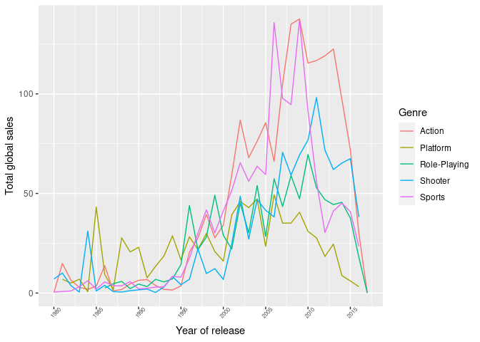
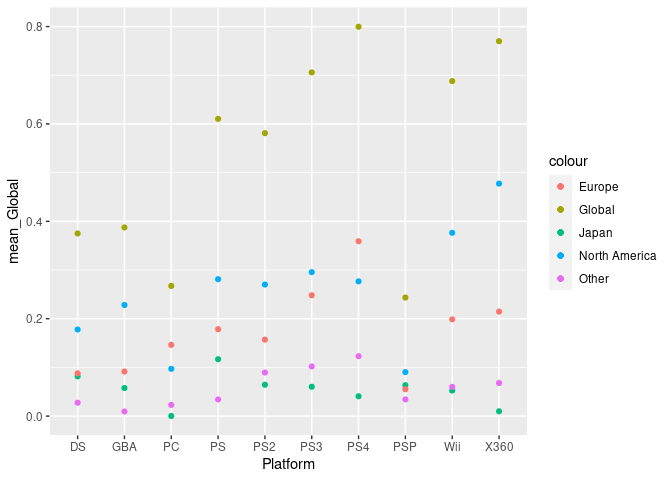

Project proposal
================
Disco

``` r
library(tidyverse)
library(broom)
library(dsbox)
library(ggridges)
library(readr)
library(here)
library(scales)
```

``` r
video_game_sales <- read_csv(here::here("data/Video_Games_Sales_as_at_22_Dec_2016.csv"))
```

    ## Rows: 16719 Columns: 16

    ## ── Column specification ────────────────────────────────────────────────────────
    ## Delimiter: ","
    ## chr (8): Name, Platform, Year_of_Release, Genre, Publisher, User_Score, Deve...
    ## dbl (8): NA_Sales, EU_Sales, JP_Sales, Other_Sales, Global_Sales, Critic_Sco...

    ## 
    ## ℹ Use `spec()` to retrieve the full column specification for this data.
    ## ℹ Specify the column types or set `show_col_types = FALSE` to quiet this message.

## 1. Introduction

Our question is: what factor influences the sales of a video game the
most.

Data is collected from
<https://www.kaggle.com/rush4ratio/video-game-sales-with-ratings>

(This dataset contains a list of video games with sales greater than
100,000 copies.)

## 2. Data

``` r
video_game_sales <- read_csv(here::here("data/Video_Games_Sales_as_at_22_Dec_2016.csv"))
```

    ## Rows: 16719 Columns: 16

    ## ── Column specification ────────────────────────────────────────────────────────
    ## Delimiter: ","
    ## chr (8): Name, Platform, Year_of_Release, Genre, Publisher, User_Score, Deve...
    ## dbl (8): NA_Sales, EU_Sales, JP_Sales, Other_Sales, Global_Sales, Critic_Sco...

    ## 
    ## ℹ Use `spec()` to retrieve the full column specification for this data.
    ## ℹ Specify the column types or set `show_col_types = FALSE` to quiet this message.

``` r
glimpse(video_game_sales)
```

    ## Rows: 16,719
    ## Columns: 16
    ## $ Name            <chr> "Wii Sports", "Super Mario Bros.", "Mario Kart Wii", "…
    ## $ Platform        <chr> "Wii", "NES", "Wii", "Wii", "GB", "GB", "DS", "Wii", "…
    ## $ Year_of_Release <chr> "2006", "1985", "2008", "2009", "1996", "1989", "2006"…
    ## $ Genre           <chr> "Sports", "Platform", "Racing", "Sports", "Role-Playin…
    ## $ Publisher       <chr> "Nintendo", "Nintendo", "Nintendo", "Nintendo", "Ninte…
    ## $ NA_Sales        <dbl> 41.36, 29.08, 15.68, 15.61, 11.27, 23.20, 11.28, 13.96…
    ## $ EU_Sales        <dbl> 28.96, 3.58, 12.76, 10.93, 8.89, 2.26, 9.14, 9.18, 6.9…
    ## $ JP_Sales        <dbl> 3.77, 6.81, 3.79, 3.28, 10.22, 4.22, 6.50, 2.93, 4.70,…
    ## $ Other_Sales     <dbl> 8.45, 0.77, 3.29, 2.95, 1.00, 0.58, 2.88, 2.84, 2.24, …
    ## $ Global_Sales    <dbl> 82.53, 40.24, 35.52, 32.77, 31.37, 30.26, 29.80, 28.92…
    ## $ Critic_Score    <dbl> 76, NA, 82, 80, NA, NA, 89, 58, 87, NA, NA, 91, NA, 80…
    ## $ Critic_Count    <dbl> 51, NA, 73, 73, NA, NA, 65, 41, 80, NA, NA, 64, NA, 63…
    ## $ User_Score      <chr> "8", NA, "8.3", "8", NA, NA, "8.5", "6.6", "8.4", NA, …
    ## $ User_Count      <dbl> 322, NA, 709, 192, NA, NA, 431, 129, 594, NA, NA, 464,…
    ## $ Developer       <chr> "Nintendo", NA, "Nintendo", "Nintendo", NA, NA, "Ninte…
    ## $ Rating          <chr> "E", NA, "E", "E", NA, NA, "E", "E", "E", NA, NA, "E",…

## 3. Data analysis plan

We will look at the different relationships between the sales (global
and specific) of a game and different factors in its release and
success. All sorts of different plots (e.g. line plot, density plot, bar
plot etc.) and data analysis methods (mean, median and mode) will be
used to discuss this and visualize this in our different individual
ways.

It will follow the ensuing format:

To be implemented as a function/script \[top\_n(category\_1, category2,
number) -&gt; {data frame of top `number` variables in the `category_1`
category with the `category_2` category values}

``` r
top_genre <- video_game_sales%>%
  group_by(Genre)%>%
  summarise(global = sum(Global_Sales))%>%
  slice_max(global, n = 5)
  
top_genre_list <<- top_genre$Genre

top_platform <- video_game_sales%>%
  group_by(Platform)%>%
  summarise(global = sum(Global_Sales))%>%
  slice_max(global, n = 10)
  
top_platform_list <<- top_platform$Platform
```

### First Data

#### A line graph showing the relationship between genre of game and TOTAL global sales over the years

#### code and plotting. a single line graph with top 5 genres and seperate faceted graphs

``` r
genre_sales_yrs <- video_game_sales%>%
  group_by(Year_of_Release, Genre)%>%
  filter(!Year_of_Release == "N/A") %>%
  filter(!is.na(Genre)) %>%
  summarise(Year_of_Release, Genre, Global_Sales = sum(Global_Sales))%>%
  group_by(Genre)%>%
  filter(Genre %in% top_genre_list) %>%
  distinct()
```

    ## `summarise()` has grouped output by 'Year_of_Release', 'Genre'. You can override using the `.groups` argument.

``` r
genre_sales_yrs%>%
  ggplot(aes(x = Year_of_Release, y = Global_Sales, color = Genre, group = Genre)) +
  theme(axis.text.x = element_text(angle = 45, size = 6)) +
  geom_line()
```

<!-- -->

### Second Data

#### A facet graph of mean sale for different area against (top 10) platform(x = platform, y = mean sale) by bar plot or histogram plot

#### Possibly change to bars for clarity

#### code and plotting.

``` r
video_game_sales %>%
  group_by(Platform) %>%
  summarise(mean_NA = mean(NA_Sales), mean_EU = mean(EU_Sales), mean_JP = mean(JP_Sales), mean_Other = mean(Other_Sales), mean_Global = mean(Global_Sales))%>%
  group_by(Platform)%>%
  filter(Platform %in% top_platform_list) %>%
  
  ggplot(aes(x=Platform))+
  geom_point(aes(y=mean_Global, colour = "Global"))+
  geom_point(aes(y=mean_NA, colour = "North America"))+
  geom_point(aes(y=mean_JP, colour = "Japan"))+
  geom_point(aes(y=mean_EU, colour = "Europe"))+
  geom_point(aes(y=mean_Other, colour = "Other"))
```

<!-- -->

### Third Data

#### A point gragh presenting the relationship between the pubisher and the mean japan’s sales, which are the top five ones. (x = Publisher, y = mean\_JP\_Sales).

#### code and plotting

``` r
video_game_sales %>%
  group_by(Publisher) %>%
  summarise(mean_JP_Sales = mean(JP_Sales)) %>%
  arrange(desc(mean_JP_Sales)) %>%
  slice(1:5) %>%
  ggplot(aes(x = Publisher, y = mean_JP_Sales)) +
  geom_point() +
  labs(title = "The five most popular Publishers in Japan",
       x = "Publisher", y = "mean_JP_Sales"
       ) +
  theme_minimal() 
```

<!-- -->

### Fourth Data

#### A comparison graph of critic score and global sales (x variable = critic score, y variable = global sales) and how they relate to each other using a line graph.

#### code and plotting

### Fifth Data

#### A scatter graph comparing the user count and user score alongside the same of comparing the critic count and critic score. Colour coded by global sales amount

#### code and plotting

### Sixth Data

#### A ridge-plot graph comparing the distribution of high selling games (games with over XXX global sales) over the years for different publishers/developers

#### code and plotting

### Seventh data

#### A list of mean global sales per genre, with box plot to show clearly the spread for each genre

#### code and plotting

### Eigth data

#### A comparison of global sales for games that were released in america against those that were not (simple 2 varaible bar graph with stacked year of release)

#### code and plotting

### etc…

### Comparison of all different data and analogies

### Written summary of what factor is mostly tied with global sales with visual proofs (plots)
